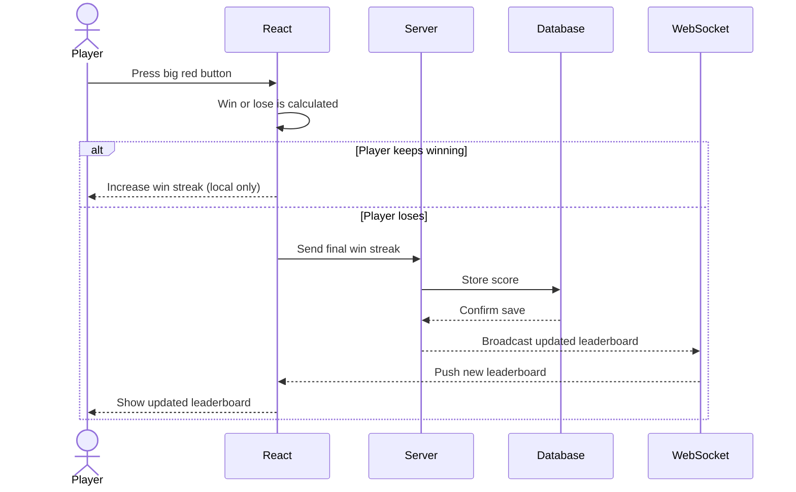

# The Button Game

[My Notes](notes.md)

This application is a simple game based on luck. A big button appears on the screen the user can press. Every button press will generate a "success" or "failure" based on a random set probability. A success streak counter will keep track of how many successful presses the user has made in a row. Users can log in and have their highest success streak recorded on a Leaderboard. 

## 🚀 Specification Deliverable

For this deliverable I did the following. I checked the box `[x]` and added a description for things I completed.

- [X] Proper use of Markdown
- [X] A concise and compelling elevator pitch
- [X] Description of key features
- [X] Description of how you will use each technology
- [X] One or more rough sketches of your application. Images must be embedded in this file using Markdown image references.

### Elevator pitch

You ever wanted the thrill of gambling in a harmless yet satisfying way? The Button Game does just that. All you have to do is press the big red button and it will tell you if you win or not. Test your luck. See how many times you can win in a row and try and get on the leaderboard. No skill needed, just luck, which makes it fun for everyone. 

### Design

Here is a diagram showing how a user would interact with the backend to update and retrieve leaderboard scores.

### Key features

- Secure login
- Random probability logic for win/loss
- Keeps track of win streak
- High scores are persistently updated
- Ability to logout and delete account

### Technologies

I am going to use the required technologies in the following ways.

- **HTML** - There will be two HTML pages: one for the login and account creation screen, and one for the main game interface
- **CSS** - CSS will be used to style the game with consistent colors, spacinga nd responsive layout so it looks good on different screen sizes. It will also be used for button animations and visual feedback when the user presses the button
- **React** - React will be used for the interactive user interface. The game will be split into components such as teh big red button, win streak dispaly, and menu buttons. React will track current win streak and results so when the player press the button, the screen updates instantly. React will also handle the switching between login and game screens
- **Service** - A backend service will provide endpoints for registering users, logging in and out, saving high scores, and retrieving the leaderboard. the service will also call a third-party API (https://uselessfacts.jsph.pl/) to fetch random facts to display when player wins. 
- **DB/Login** - This will be used to store authentication information, users' account, user's high scores, and leaderboard
- **WebSocket** - A WebSocket connnection will be used to send and receive real-time updates of the leaderboard. 

## 🚀 AWS deliverable

For this deliverable I did the following. I checked the box `[x]` and added a description for things I completed.

- [X] **Server deployed and accessible with custom domain name** - [My server link](http://theredbuttongame.click/).

## 🚀 HTML deliverable

For this deliverable I did the following. I checked the box `[x]` and added a description for things I completed.

- [ ] **HTML pages** - I did not complete this part of the deliverable.
- [ ] **Proper HTML element usage** - I did not complete this part of the deliverable.
- [ ] **Links** - I did not complete this part of the deliverable.
- [ ] **Text** - I did not complete this part of the deliverable.
- [ ] **3rd party API placeholder** - I did not complete this part of the deliverable.
- [ ] **Images** - I did not complete this part of the deliverable.
- [ ] **Login placeholder** - I did not complete this part of the deliverable.
- [ ] **DB data placeholder** - I did not complete this part of the deliverable.
- [ ] **WebSocket placeholder** - I did not complete this part of the deliverable.

## 🚀 CSS deliverable

For this deliverable I did the following. I checked the box `[x]` and added a description for things I completed.

- [ ] **Visually appealing colors and layout. No overflowing elements.** - I did not complete this part of the deliverable.
- [ ] **Use of a CSS framework** - I did not complete this part of the deliverable.
- [ ] **All visual elements styled using CSS** - I did not complete this part of the deliverable.
- [ ] **Responsive to window resizing using flexbox and/or grid display** - I did not complete this part of the deliverable.
- [ ] **Use of a imported font** - I did not complete this part of the deliverable.
- [ ] **Use of different types of selectors including element, class, ID, and pseudo selectors** - I did not complete this part of the deliverable.

## 🚀 React part 1: Routing deliverable

For this deliverable I did the following. I checked the box `[x]` and added a description for things I completed.

- [ ] **Bundled using Vite** - I did not complete this part of the deliverable.
- [ ] **Components** - I did not complete this part of the deliverable.
- [ ] **Router** - I did not complete this part of the deliverable.

## 🚀 React part 2: Reactivity deliverable

For this deliverable I did the following. I checked the box `[x]` and added a description for things I completed.

- [ ] **All functionality implemented or mocked out** - I did not complete this part of the deliverable.
- [ ] **Hooks** - I did not complete this part of the deliverable.

## 🚀 Service deliverable

For this deliverable I did the following. I checked the box `[x]` and added a description for things I completed.

- [ ] **Node.js/Express HTTP service** - I did not complete this part of the deliverable.
- [ ] **Static middleware for frontend** - I did not complete this part of the deliverable.
- [ ] **Calls to third party endpoints** - I did not complete this part of the deliverable.
- [ ] **Backend service endpoints** - I did not complete this part of the deliverable.
- [ ] **Frontend calls service endpoints** - I did not complete this part of the deliverable.
- [ ] **Supports registration, login, logout, and restricted endpoint** - I did not complete this part of the deliverable.

## 🚀 DB deliverable

For this deliverable I did the following. I checked the box `[x]` and added a description for things I completed.

- [ ] **Stores data in MongoDB** - I did not complete this part of the deliverable.
- [ ] **Stores credentials in MongoDB** - I did not complete this part of the deliverable.

## 🚀 WebSocket deliverable

For this deliverable I did the following. I checked the box `[x]` and added a description for things I completed.

- [ ] **Backend listens for WebSocket connection** - I did not complete this part of the deliverable.
- [ ] **Frontend makes WebSocket connection** - I did not complete this part of the deliverable.
- [ ] **Data sent over WebSocket connection** - I did not complete this part of the deliverable.
- [ ] **WebSocket data displayed** - I did not complete this part of the deliverable.
- [ ] **Application is fully functional** - I did not complete this part of the deliverable.
