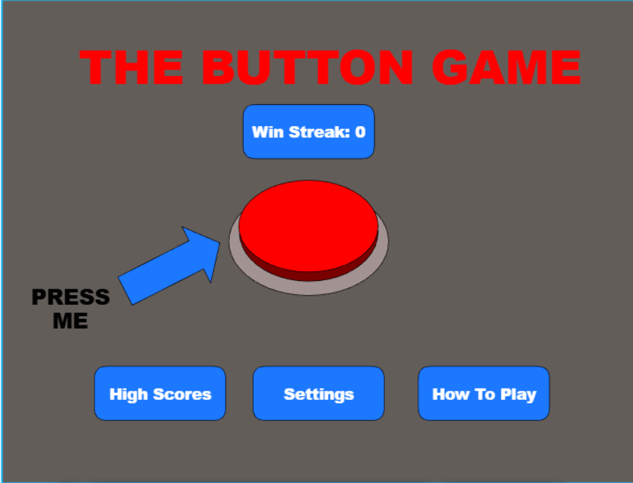

# CS 260 Notes

## GIT Stuff

These are all the main git commands and processes that I will probably be using:

**git add** and **git commit** used to locally save progress.
**git status** shows local saved progress. 
**git log** is another thing to show local progress but specifically for the commits.
**Git push** is used when you want your local progress to be saved to the cloud github version.
**Git pull** makes your local system match the cloud github version automatically. 
**Git fetch** gets a quick update from the cloud github to see if your local version is different from the cloud github. 
**git init** creates local repo but dont do that, its easier to make repo on github. To make local version of a project off github use **git clone**. 
**git branch "name"** creates a new branch but you still stay on the original branch until you change to the new branch you just created. to go to the new branch you do **git checkout "name"**. To merge brances I think easiest way is to go to the original branch which is called main or master (so do that checkout command) then do **git merge "name"** using the name of the other branch. 
**git diff** is good to show differences between code on different commits, I think there's more to the formating.

- [ ] I Would love to mess around and work more on forking in github which seems like a version of git clone a repositiory but like copying the whole git website project...not sure.

## Markup Stuff

this github doc gives good basics on markup stuff [link shortcut](https://docs.github.com/en/get-started/writing-on-github/getting-started-with-writing-and-formatting-on-github/basic-writing-and-formatting-syntax)

Here's me practicing:

A quote 
> "To be or not to be"

an image


lists
* dog
* cat
* horse
- ruff
- meow
+ lol

1. hi
- nested isnt working on preview
2. bye
3. yes

- [ ] task box isnt working on preview


emojis
:smiley:
:wink:    
^these arent working for preview so hoepuflly they do online


## Terminal notes

For this class they reccomend git bash terminal but WSL would work which I have downloaded. Might be good idea to study more on what WSL actually is.
1. echo - Output the parameters of the command
2. cd - Change directory
3. mkdir - Make directory
4. rmdir - Remove directory
5. rm - Remove file(s)
6. mv - Move file(s)
7. cp - Copy files
8. ls - List files
9. curl - Command line client URL browser
10. grep - Regular expression search
11. find - Find files
12. top - View running processes with CPU and memory usage
13. df - View disk statistics
14. cat - Output the contents of a file
15. less - Interactively output the contents of a file
16. wc - Count the words in a file
17. ps - View the currently running processes
18. kill - Kill a currently running process
19. sudo - Execute a command as a super user (admin)
20. ssh - Create a secure shell on a remote computer
21. scp - Securely copy files to a remote computer
22. history - Show the history of commands
23. ping - Check if a website is up
24. tracert - Trace the connections to a website
25. dig - Show the DNS information for a domain
26. man - Look up a command in the manual

1. | - Take the output from the command on the left and pipe, or pass, it to the command on the right
2. \> - Redirect output to a file. Overwrites the file if it exists
3. \>> - Redirect output to a file. Appends if the file exists

For VIM here's command cheat sheet [link](https://vim.rtorr.com/)

:h	help
i	enter insert mode. This will allow you to type and delete text. Use ESC to exit insert mode. No other commands will work while in insert mode.
u	undo
CTRL-r	redo
gg	go to beginning of file
G	go to end of file
/	search for text that you type after /
n	next search match
N	previous search match
v	visually select text
y	yank or copy selected text to clipboard
p	paste clipboard
CTRL-wv	Split window vertically
CTRL-ww	Toggle windows
CTRL-wq	Close current window
:e	Open a file. Type ahead available. If you open a directory you can navigate it in the window
:w	write file (save)
:q	quit. Use :q! to exit without saving

## Class link

- [Course instruction](https://github.com/webprogramming260)

## AWS

My IP address is: 44.193.104.163

http://theredbuttongame.click/

to ssh into server use 
>ssh -i [key pair file] ubuntu@[ip address]

To find an ip address based on domain name use command "dig". To find all the different router ips it goes through you use traceroute. All through ubuntu.

To change a files read/write stuff use chmod 400 [key file] which makes only owner readable or chmod 600 [key file] which makes only owner readable and writable. 

I learned that if I want to use VScode to edit the server then there needs to be more storage on the server for it to download a mini vscode thing on it, but my server is tiny so it cannot do that so that is why you have to use vim. ALSO, when I was trying to ssh to server with vscode chatgpt told me to make a .config file, which for future reference I guess makes signing into server a lot easier and faster. Not totally sure about how it all works.

## Caddy

From what I understand, Caddy is a helper for the HTTPS certificate stuff.

## HTML

### Deployment script example
```sh
#!/bin/bash

while getopts k:h:s: flag
do
    case "${flag}" in
        k) key=${OPTARG};;
        h) hostname=${OPTARG};;
        s) service=${OPTARG};;
    esac
done

if [[ -z "$key" || -z "$hostname" || -z "$service" ]]; then
    printf "\nMissing required parameter.\n"
    printf "  syntax: deployFiles.sh -k <pem key file> -h <hostname> -s <service>\n\n"
    exit 1
fi

printf "\n----> Deploying files for $service to $hostname with $key\n"

# Step 1
printf "\n----> Clear out the previous distribution on the target.\n"
ssh -i "$key" ubuntu@$hostname << ENDSSH
rm -rf services/${service}/public
mkdir -p services/${service}/public
ENDSSH

# Step 2
printf "\n----> Copy the distribution package to the target.\n"
scp -r -i "$key" * ubuntu@$hostname:services/$service/public
```

so link has form <a href="link stuff"> link text that peeps click on <a>

to include an image 

## CSS

This took a couple hours to get it how I wanted. It was important to make it responsive and Bootstrap helped with that. It looks great on all kinds of screen sizes.

Bootstrap seems a bit like magic. It styles things nicely, but is very opinionated. You either do, or you do not. There doesn't seem to be much in between.

I did like the navbar it made it super easy to build a responsive header.

```html
      <nav class="navbar navbar-expand-lg bg-body-tertiary">
        <div class="container-fluid">
          <a class="navbar-brand">
            
            Calmer
          </a>
          <button class="navbar-toggler" type="button" data-bs-toggle="collapse" data-bs-target="#navbarSupportedContent">
            <span class="navbar-toggler-icon"></span>
          </button>
          <div class="collapse navbar-collapse" id="navbarSupportedContent">
            <ul class="navbar-nav me-auto mb-2 mb-lg-0">
              <li class="nav-item">
                <a class="nav-link active" href="play.html">Play</a>
              </li>
              <li class="nav-item">
                <a class="nav-link" href="about.html">About</a>
              </li>
              <li class="nav-item">
                <a class="nav-link" href="index.html">Logout</a>
              </li>
            </ul>
          </div>
        </div>
      </nav>
    </header>
```

I also used SVG to make the icon and logo for the app. This turned out to be a piece of cake.

```html
<svg width="100" height="100" xmlns="http://www.w3.org/2000/svg">
  <rect width="100" height="100" fill="#0066aa" rx="10" ry="10" />
  <text x="50%" y="50%" dominant-baseline="central" text-anchor="middle" font-size="72" font-family="Arial" fill="white">C</text>
</svg>
```

## React Part 1: Routing

Setting up Vite and React was pretty simple. I had a bit of trouble because of conflicting CSS. This isn't as straight forward as you would find with Svelte or Vue, but I made it work in the end. If there was a ton of CSS it would be a real problem. It sure was nice to have the code structured in a more usable way.

## React Part 2: Reactivity

This was a lot of fun to see it all come together. I had to keep remembering to use React state instead of just manipulating the DOM directly.

Handling the toggling of the checkboxes was particularly interesting.

```jsx
<div className="input-group sound-button-container">
  {calmSoundTypes.map((sound, index) => (
    <div key={index} className="form-check form-switch">
      <input
        className="form-check-input"
        type="checkbox"
        value={sound}
        id={sound}
        onChange={() => togglePlay(sound)}
        checked={selectedSounds.includes(sound)}
      ></input>
      <label className="form-check-label" htmlFor={sound}>
        {sound}
      </label>
    </div>
  ))}
</div>
```
